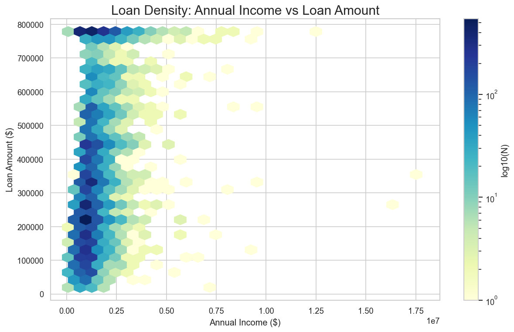
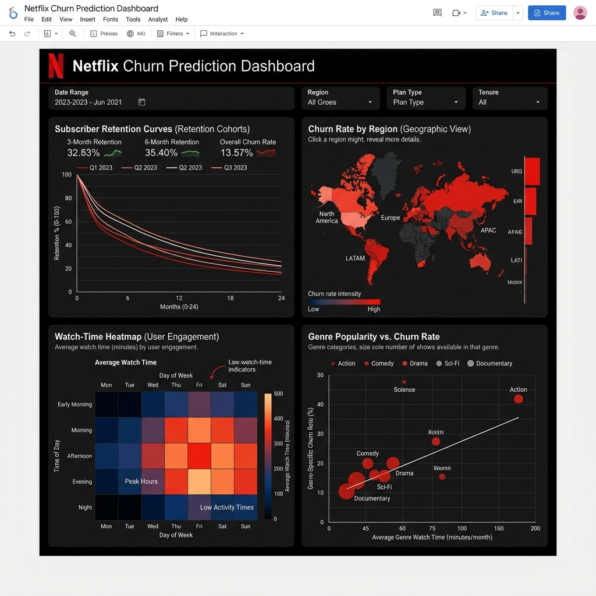
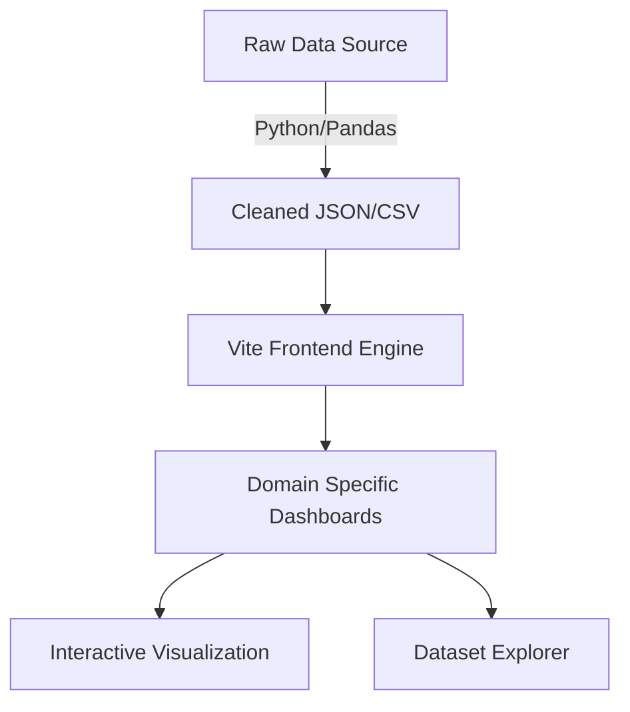

# <align align="center"> 📊 Analytica – Professional Data Intelligence Suite </align>

<p align="center">
  
  
  
  
  
</p>

---

## 🌟 Project Overview

**Analytica** is a high-performance, multi-domain data intelligence ecosystem designed to transform raw industrial datasets into actionable strategic insights. By aggregating high-volume data from **Netflix, Uber, Blinkit, and Banking** sectors, the platform provides a unified "Single Source of Truth" for complex business challenges.

> "Turning data noise into strategic signals through advanced visualization and predictive modeling."

---

## 🚀 Key Features

- **🌐 Multi-Domain Aggregation**: Seamless integration of cross-industry datasets including Fintech, E-commerce, and Urban Mobility.
- **📈 Professional Dashboarding**: High-fidelity dark-mode interfaces featuring domain-specific branding (GitHub-Emerald, Netflix-Red).
- **⚡ Dynamic Data Engine**: Real-time dataset previews and interactive filtering for deep-dive analysis.
- **🗺️ Geospatial Intelligence**: Advanced heatmapping for urban mobility and demand distribution.
- **🤖 Predictive Workflows**: Automated churn prediction and risk assessment modeling using Python & Pandas.

---

## 🛠️ Technology Stack

| Layer | Technologies |
| :--- | :--- |
| **Frontend** | React 18, Vite, Tailwind CSS, Framer Motion |
| **Data Engine** | Python 3.x, Pandas, NumPy |
| **Visualization** | Matplotlib, Seaborn, Tableau, Looker Studio |
| **Infrastructure** | GitHub Actions, Vercel, MongoDB |

---

## 📂 Project Modules

| Module | Core Problem Solved | Data Focus |
| :--- | :--- | :--- |
| **🏦 Bank Loan** | Credit Risk & Default Prediction | Income, Credit Score, Delinquency |
| **🍿 Netflix** | User Retention & Churn Mitigation | Watch Hours, Regional Loyalty |
| **🚗 Uber** | Urban Mobility & Demand Allocation | Geospatial Trip IDs, Fare Density |
| **🛍️ Blinkit** | Inventory Churn & SKU Popularity | SKUs, Delivery Lead Times |

---

## 📸 Interface Preview

<p align="center">
  
  
</p>

---

## 🛠️ Getting Started

### Prerequisites
- Node.js (v18+)
- Python 3.10+
- npm or yarn

### Installation
1. **Clone the Repository**
   ```bash
   git clone https://github.com/Aman-kumar-git12/Analytica.git
   cd Analytica
   ```

2. **Install Dependencies**
   ```bash
   npm install
   ```

3. **Run Dev Server**
   ```bash
   npm run dev
   ```

---

## 🏗️ Architecture



---

## 🤝 Contact

**Aman Kumar**  
[](https://github.com/Aman-kumar-git12)
[](https://linkedin.com/in/aman-kumar)

---
<p align="center"> Built with ❤️ for the Data Science Community </p>
