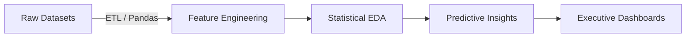

# <align align="center"> 📊 Analytica – Data Science & Analytical Intelligence Portfolio </align>

  
  
  
  
  

---

## 🌟 Portfolio Overview

**Analytica** is a specialized data science repository focused on extracting high-value business intelligence from industrial datasets. This portfolio demonstrates the end-to-end analytical lifecycle: from **raw data ingestion and cleaning** to **exploratory data analysis (EDA)** and **strategic visualization**.

> "Transforming complex datasets into clear, actionable business narratives through statistical rigor and visual clarity."

---

## 🔬 Analytical Modules & Methodologies

Each module represents a deep-dive into a specific business domain, utilizing industry-standard tools to solve core operational problems.

| Module | Analytical Focus | Methodologies Used | Tooling |
| :--- | :--- | :--- | :--- |
| **🏦 Bank Loan** | **Credit Risk Profiling** | Correlation Heatmapping, Distribution Analysis, Feature Importance | Python, Pandas, Seaborn |
| **🍿 Netflix** | **Retention Analytics** | Churn Prediction modeling, Behavioral segmentation, Tenure analysis | Python, Pandas, Matplotlib |
| **🚗 Uber** | **Demand Intelligence** | Geospatial trip distribution, Peak-hour density mapping | Tableau, Geospatial Analysis |
| **🛍️ Blinkit** | **Inventory Optimization** | SKU Popularity metrics, Lead-time variance analysis, Churn tracking | Spreadsheet, Statistical modeling |

---

## 🛠️ Data Intelligence Stack

### **Data Processing & Engineering**
- **Python (Pandas/NumPy)**: Primary engine for data cleaning, handling missing values, and feature engineering.
- **ETL Pipelines**: Transformation of raw CSV/JSON logs into structured analytical schemas.

### **Exploratory Data Analysis (EDA)**
- **Statistical Profiling**: Analyzing skewness, kurtosis, and variance across financial and behavioral metrics.
- **Correlation Mapping**: Identifying non-obvious relationships between variables (e.g., *Credit Score vs. Monthly Debt*).

### **Visual Intelligence**
- **Matplotlib/Seaborn**: High-fidelity statistical plotting with custom-branded themes (e.g., GitHub-Emerald, Netflix-Red).
- **Tableau**: Interactive geospatial dashboards for urban mobility and logistics tracking.

---

## 🏗️ Analytical Workflow

---

## 📂 Project Structure

- **`datasets/`**: Curated industrial datasets (Banking, OTT, Logistics, Mobility).
- **`notebooks/`**: Comprehensive Jupyter notebooks containing the core EDA and modeling logic.
- **`src/`**: Interactive showcase interface built for data presentation.

---

## 🤝 Contact

**Aman Kumar**  

---

 Dedicated to turning data noise into strategic signals. 

